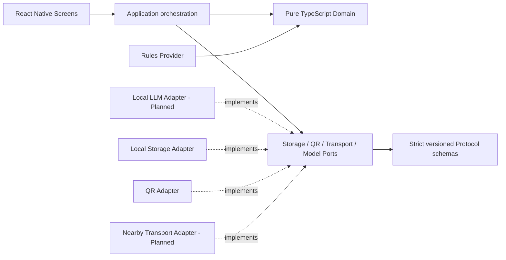

# Architecture Overview

## 依存方向

実線は現在の Source import / call の向き、破線は Port の実装関係です。`Planned` の Adapter は設計境界または
Draft PR があっても、default branch で利用できる実装として扱いません。

図を使わない同等説明は次のとおりです。

1. Screen は入力と表示を担当し、Application orchestration を呼ぶ。
2. Application orchestration は純 TypeScript Domain と Port に依存する。
3. Domain は React、React Native、Expo、Storage、Transport、Model Runtime を import しない。
4. Rules Provider は Domain の正規化済み入力だけを使い、Web / Expo Go の offline reference path になる。
5. Local Storage と QR の Platform Adapter は Port を実装する。QR の実 Camera、権限、複数端末は別の物理 Gate である。
6. Local LLM Adapter と実 Nearby Transport Adapter は default branch では `Planned` である。
7. Protocol は strict versioned schema、上限、期限、去重、順序を検証し、Transport 固有 API を Domain へ漏らさない。

## データ境界

- Local Profile は端末内だけに保存し、共有前に `PublicPassport` へ投影する。
- QR / Peer Payload は versioned schema を境界で検証し、未知 Field と上限超過を拒否する。
- Lounge 由来データは永続化せず、退出、Host 終了、20 分満了の最早契機で破棄する。
- Rules / Local LLM は同じ閉じた Decision 契約を返す。Model Output を UI、Log、次の Prompt へそのまま反射しない。
- Diagnostics と Pilot Measurement は allowlist された内容非保持データだけを扱い、Telemetry Backend を持たない。

詳細は [Data Model](./data-model.md)、[Peer Protocol](./peer-protocol.md)、
[Steering](./steering.md)、[Quality Bar](./quality-bar.md)を参照してください。
