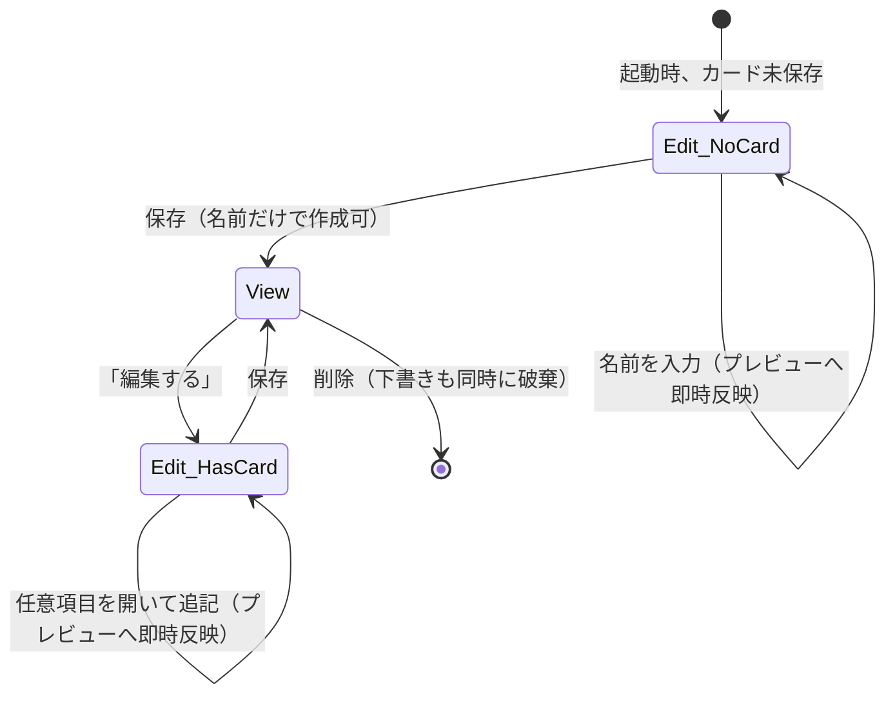

# 自己紹介カード作成フロー再設計（名前だけで即生成 → プレビューで追記）

Issue: https://github.com/susumutomita/TenkaCloudPassport/issues/93 （owner 実機録画フィードバックが正本）。
前提: Issue 90（named-link UI・キーボード chain）・Issue 92（NFKC 正規化・エラー focus）のマージ済み実装
（`src/screens/IntroCardEditScreen.tsx` / `src/screens/intro-card-links.ts` / `src/domain/intro-card.ts`）の上に組む。

## 問題

owner の実機録画では、カード 1 枚の作成に約 90 秒かかっている。原因は完成画面のデザインではなく、
「最初からすべての項目が並んだ長いフォームを、任意項目まで順番に埋めるものだと感じさせる」導線にある。
加えてキーボード表示中に入力欄・保存ボタンが隠れる、プレビューを見ながら入力できない、アプリを離れると
入力内容が消える、といった複数の摩擦が重なっている。

Issue 90/92 で「入力欄の構成・正規化・エラー focus」はすでに直っているため、本 Issue の scope は
**フォームの見せ方そのもの**（段階的開示・即時生成・ライブプレビュー・下書き保持・sticky footer・
入力中バリデーション）に絞る。連絡先 / GitHub プロフィール / 既存 JSON からの取り込みは、
新しい権限・依存（`expo-contacts` 等）を伴うため本 Issue では設計だけ残し、実装は follow-up Issue に切る
（後述）。

## 代替案

### 案 A: 新しい「クイック作成」専用 Stage + 専用 Screen を追加する

`SetupStage` に `'intro-card-quick-create'` を新設し、名前 1 項目だけの専用 Screen を作る。生成後は
既存の `IntroCardEditScreen`（フル編集画面）へ遷移し、そこにライブプレビューを足す。

- 利点: 「最初の 1 画面」の実装が単純（項目が 1 つだけの Screen を素直に書ける）。
- 欠点: Stage が 1 つ増え、`PassportApp.tsx`（既に 2,300 行超の集約 Component）・
  `IntroCardStageGate`・起動時の着地判定（`introCardHomeStage`）・関連 wiring テスト
  （`intro-card-app-wiring.test.ts` / `passport-app-stage-flow.test.ts`）のすべてに新しい分岐が要る。
  さらに「生成直後にフル編集画面へ自動遷移」を新設すると、既存の
  「保存成功後は `'intro-card'`（表示・共有画面）へ行く」という、以前の Issue 92 のレビューを経て
  安定している契約と別の着地ルールが 1 つ増えることになり、Cognitive Complexity と回帰リスクが上がる。

### 案 B: 既存の編集画面 1 つを「段階的開示」に作り替える（採用）

新しい Stage・新しい Screen ファイルを増やさず、`IntroCardEditScreen` 自体を次のように変える。

1. 名前欄は常に表示（既存のまま、最上部）。
2. 名前欄のすぐ下に、現在の入力値を反映するライブプレビュー（`IntroCardPreview`、後述）を常設する。
3. 肩書き・所属・自己紹介・メール・電話・リンクの 6 項目は「任意項目を追加する」ボタンで
   開閉するセクションへ折りたたむ。初期状態は、（a）どれか 1 つでも既に値がある（＝既存カードの
   再編集）なら開いた状態、（b）真っさらな新規作成なら閉じた状態から始める。保存失敗の原因が
   折りたたみ内の項目なら自動的に開く（エラーを隠さない）。
4. 画面下部の Save / Backup / Settings ボタンは `AppScreen` に新設する `footer` prop で
   `ScrollView` の外（`KeyboardAvoidingView` 配下）に固定し、キーボード表示中も操作できるようにする。
5. 各入力欄に `onBlur` を追加し、`domain/intro-card.ts` の私有 validator をそのまま再利用する
   `validateIntroCardFieldValue`（新規 export）で、保存前でも欄単位のエラーをその場に出す。

「名前だけ入力 → 保存」は既存の `saveIntroCard`（`createIntroCard({name})` は既に許容している）を
そのまま呼ぶだけで成立し、保存後は既存どおり `'intro-card'`（表示・共有 QR 画面）へ遷移する。
owner の言う「プレビュー画面」は、この既存の表示画面（`IntroCardScreen`）がそのまま兼ねる。
そこにある「編集する」ボタンで戻ると、今回作った段階的開示編集画面が「任意項目を見ながら追記する」
体験を提供する。

- 利点: 新しい Stage・新しい Screen ファイル・`PassportApp.tsx` の JSX 配線変更が不要（プレビュー・
  折りたたみ・inline validation はすべて `IntroCardEditScreen` 内の既存 props から計算できる）。
  Issue 92 まで作り込んだ「保存失敗時の focus・errorFieldKey」の契約を一切変えずに乗せられる。
  `IntroCardStageGate` の 2 Stage 判定・起動時の着地判定は無変更。
- 欠点: `IntroCardEditScreen.tsx` 自体は 1 画面でさらに責務が増える（プレビュー描画は
  `IntroCardPreview` へ外出しして緩和する）。「名前だけ入力 → 生成」の体験は、厳密には
  「量が少ないフォームの上のほうだけ触って Save を押す」であり、専用の 1 問 1 答画面ほどの
  儀式感の排除にはならない。ただし完了条件（20 秒以内・長いスクロールなし・任意項目 0 件でも
  作成可）はすべて満たせる。

案 B を採用する。理由: 完了条件を満たすうえで必要な変更が「見せ方」の範囲に収まるなら、Stage を
増やして状態遷移の面を広げるより、既存 1 画面の中で完結させるほうが shippable かつ低リスクである
（quality-bar.md の「最初に動いた構造を採用しない」は満たしつつ、「増やせる状態遷移は増やさない」
という既存アーキテクチャの一貫性も守る）。

### 案 C: 任意項目をモーダル / ボトムシートで開く

- 利点: 「折りたたみ」よりも「今は隠れている」ことが視覚的に明確。
- 欠点: React Native 標準にボトムシートはなく、新規依存（`@gorhom/bottom-sheet` 等）が要る。
  本 Issue の実装ノートは連絡先取込等の「新規依存を伴うものは follow-up」という方針であり、
  UI 用の新規依存もその方針と矛盾する。不採用。

## 画面遷移

`Edit_NoCard` と `Edit_HasCard` は同じ Component（`IntroCardEditScreen`）であり、Stage としては
どちらも既存の `'intro-card-edit'` のまま。差は「任意項目セクションの初期開閉状態」と
「表示中のプレビュー内容」だけである。

## 下書き（draft）永続化の設計

「アプリを一度離れて戻っても入力内容を維持する」を、既存の `IntroCardStoragePort`
（`src/app/intro-card-storage.ts`）に `loadDraft` / `saveDraft` / `clearDraft` を追加する形で実現する
（実装ノートの指示どおり、新しい Storage Port を増やさず既存 Storage に別キーを足す）。

- Web: 同じ `WebKeyValueStorage` に対して、確定カードとは別の key
  （`tenkacloud-passport.intro-card-draft`）を使う。
- Native: `ExpoFileSystemIntroCardStorageAdapter` のコンストラクタに 2 つ目の `ProfileDocument`
  （下書き専用ファイル、`tenkacloud-passport-intro-card-draft.json`）を追加する。

下書きは「バリデーション前の生の入力文字列」（`IntroCardDraftFields`）であり、`IntroCardStorageError`
は投げうるが、**呼び出し側（`PassportApp.tsx`）は必ず `.catch(() => undefined)` で握り潰す**。
下書きは nice-to-have であり、書き込み・読み込みのどちらが失敗しても、保存済みカードの読み込みや
保存そのものを妨げてはならない。

### 反映（persist）のタイミング: debounce タイマーを採用しない

検討した設計は 2 つ。

1. 各入力欄の `onBlur` イベントで都度 `saveDraft` する（イベント駆動）。
2. 下書きの全 state を依存配列に持つ `useEffect` で、値が変わるたびに（`setTimeout` で
   debounce してから）`saveDraft` する。

(1) は、focus を移さず保存ボタンだけ押すケース（自由リンク追加直後 → 未 blur のまま保存、等）を
取りこぼしうる。(2) の debounce 付きはキーストロークごとの実 I/O を間引けるが、レンダリング基盤
（React Testing Library 相当）を持たないこの repo では `setTimeout` の実際のタイミング・cleanup を
実行検証できず、ソーステキスト契約テストでは「タイマーを設定している」ことしか固定できない
（バグを作り込んでも赤にならないリスクの方が、書き込み回数の最適化より大きいと判断した）。

採用: **debounce なしの `useEffect`**。下書き用の 11 個の state（name/title/organization/selfIntro/
email/phone/linkX/linkGithub/linkLinkedin/linkPortfolio/otherLinks）を依存配列に持ち、値が変わった
コミットのたびに `saveDraft`（非空なら）または `clearDraft`（全欄空なら）を fire-and-forget で呼ぶ。
書き込みは非同期・`await` しないため、タイプ中の体感には影響しない。書き込み回数がキー入力ごとに
増える点は許容する（個人が自分のカードを編集するだけの操作量であり、ホットループではない）。

### 起動時の水和（hydrate）順序とレース条件

起動時 `useEffect` は既存の `Promise.all([recoverLocalStateAtStartup(...), introCardStorage.load()...])`
に `introCardStorage.loadDraft().catch(() => null)` を第 3 要素として足す。`.then()` 側で、
読み込んだ下書きが空でなければ `introCardDraftName` 等へ反映してから、`introCardDraftHydrated`
（新規 state、既定 `false`）を `true` にする。

上記の「debounce なし `useEffect`」は、この `introCardDraftHydrated` が `true` になるまでは
何もしない（早期 return）。理由: マウント直後は下書き全欄が空 state で始まるため、ガードなしだと
「全欄空 → `clearDraft()`」が実行され、これが非同期の `loadDraft()` より先に完了すると、
まだ読み込んでいない下書きファイルを消してしまうレース条件になりうる（実データ消失のリスク）。
`introCardDraftHydrated` は起動処理の完了を待ってから `true` になるため、このレースを構造的に防ぐ。

### 精度（precedence）: 下書き は 保存済みカード より新しい編集として優先する

`openIntroCardEdit()`（「編集する」ボタン）は、現在の下書き state が
（`isEmptyIntroCardDraft` で見て）空のときだけ `introCard` から初期値を組み立てる。下書きが
既に値を持っている場合（起動時に水和済み、または前回の編集セッションが未保存のまま）は、
その下書きをそのまま使い、保存済みカードの値で上書きしない。「保存されていない直近の入力」を
「最後に確定保存した内容」より優先する、という 1 つの原則で説明できる。

### 削除時の扱い

`deleteIntroCard()` は `introCardStorage.remove()` 成功後、下書き state を空文字へ戻す（既存）のに
加えて `introCardStorage.clearDraft()` を明示的に（fire-and-forget で）呼ぶ。debounce なしの
`useEffect` も state リセット後に自動的に `clearDraft()` を呼ぶため二重にはなるが、「アプリ強制終了で
`useEffect` が間に合わない」場合の保険として、削除操作自身にも明示呼び出しを残す
（削除したカードの断片が下書きとして残り続けると、次回起動時に消えたはずのカードの内容が
編集画面へ蘇る、という分かりにくい不具合になるため）。

## 入力中バリデーション（onBlur）の設計

`src/domain/intro-card.ts` に `validateIntroCardFieldValue` を追加する。`createIntroCard` が使う
私有 validator（`validatedName` / `validatedOptionalField` / `validatedEmail` / `validatedPhone` /
リンク単体の形式チェック）をそのまま再利用し、例外を投げる代わりにメッセージ文字列 `| null` を返す。
保存時の検証と **同じ関数を再利用する**ことで、Issue 92 で code-reviewer に指摘された「画面側で
検証ロジックを再実装して保存時の判定と drift する」バグ class を最初から作らない。

- `name` だけ特例: 空（未入力）は onBlur では何も表示しない（`NAME_REQUIRED` を握り潰す）。
  理由: 真っさらな画面でまず名前欄をタップしてから離れただけで「名前を入力してください」という
  赤い文字が出るのは、望ましい体験（「急かされない」）に反する。文字数超過（NFKC 展開後 50 文字超）
  はそのまま表示する。必須チェック自体は保存時（既存の `errorFieldKey==='name'`）で担保する。
- リンク系（X/GitHub/LinkedIn/Portfolio/自由リンク）は、画面側で `normalizeNamedLink` を適用してから
  `validateIntroCardFieldValue({ field: 'links', value })` へ渡す。X・GitHub・LinkedIn は
  ユーザー名だけの入力を許可する契約（Issue 90）があるため、正規化前の生文字列をそのまま渡すと
  「ユーザー名だけの正しい入力」を誤って無効判定してしまう（Issue 92 と同じ class の drift）。

表示の優先順位: 保存時のエラー（`errorFieldKey` / `notice`）を入力欄直下の第一候補にしつつ、
その欄を一度でも blur した後は、その場のバリデーション結果（valid になっていれば消える）が
保存時のエラーより優先される。新しい保存の失敗・成功が起きるたびに、この「blur 済み」の記録は
リセットする（次の保存結果を素直に表示するため）。保存ボタンの活性・非活性はこの inline
バリデーションで制御しない（保存時の検証が唯一の正・ゲート、既存のまま）。

## エッジケース

- 名前を 1 文字も入力せず Save を押す: 既存どおり `NAME_REQUIRED` で保存が失敗し、name 欄へ focus。
- 任意項目を 1 つも触らずに Save: 既存どおり成功する（`createIntroCard` は元々 name 以外 optional）。
- 任意項目セクションを開かずに保存が失敗した（例: 前回保存の残骸ではなく、他の原因で `email` が
  無効）: 保存失敗の `errorFieldKey` がセクション内のキーなら、セクションを自動的に開く。
- リンク欄が 5 件超過: 既存の `overLinkCount` 表示のまま（inline validation は 1 欄ずつの形式/文字数
  だけを見るため、件数超過はこれまでどおり保存時の一括表示に委ねる）。
- QR の byte 予算超過（1,024 byte）: 既存のまま、保存前の見積り表示を維持する。
- Storage 自体が使えない環境（`storage-unavailable`）: 下書きの読み書きも同じ理由で失敗するが、
  `.catch(() => undefined)` で握り潰すため、カード本体の read/write のエラー表示（既存）だけが出る。
  下書きが使えないこと自体はユーザーに新たに通知しない（機能が 1 段階弱くなるだけで、致命的ではない）。
  Native 環境で下書き専用ファイルの取得だけがなぜか失敗するケース（本体は成功）も同じ扱いにする。
  Playbook: 端末の空き容量不足等が疑われる場合は `LocalDiagnosticsScreen`（既存）の Storage 使用量
  確認で調査する（新しい診断 UI は本 Issue の scope 外）。
- 起動直後、下書き読み込みが確定カードの読み込みより遅く終わる: 両方とも同じ `Promise.all` の
  要素であり、`.then()` 側で両方が揃ってから 1 度に反映するため、片方だけ反映される中間状態はない。
- 下書きは存在するが、その後 confirmed card が別経路（このセッションでは存在しないが将来の
  Backup Import 等）で書き換わるケース: 本 Issue の scope 外（Backup import は現状 Intro Card を
  allowlist に含めない、既存 ADR-0007 のまま）。

## Follow-up（本 Issue の scope 外、別 Issue へ切り出す）

実装ノートの指示どおり、以下は設計だけをここに残し、実装は別 Issue にする（`/follow-up add` 済み）。

- **連絡先（Contacts）からの取り込み**: `expo-contacts` の追加と権限プロンプトが要る。取り込んだ
  氏名・電話・メールは `IntroCardDraftFields` へそのままマップし、正規化・検証は既存の
  `createIntroCard` パイプラインへ完全に委ねる（取り込み専用の検証ロジックを新設しない）。
  Contacts 側の複数電話番号・複数メールは「最初の 1 件」を採用し、残りは自由リンク相当の
  追加欄を増やす UI ではなく、単純に破棄する（複雑な選択 UI は別途要検討）。
- **GitHub プロフィールからの取り込み**: GitHub の公開 API（`api.github.com/users/:login`）から
  name・bio・blog（Portfolio 相当）・avatar（今回は使わない）を取得し、`linkGithub` と
  `selfIntro`・`linkPortfolio` の初期値へ流し込む。ネットワークアクセスを伴うため、
  ADR-0007 のデータ最小化契約・オフライン前提とどう両立するか（明示的なユーザー操作でのみ
  fetch する、失敗時はフォームの現在値を一切変えない、等）を別 Issue の設計で詰める。
- **既存 JSON からの取り込み**: `IntroCardStoragePort` が既に扱う JSON 形状
  （`parseStoredIntroCard` と同じ構造）をそのまま受け付け、Backup Import 画面
  （`BackupImportScreen`）が持つ「貼り付け → 検証 → 確定」の導線を踏襲するのが自然だが、
  Intro Card は現状 Backup の allowlist に含まれない（ADR-0007）ため、含めるかどうかを含めて
  別 Issue で判断する。

## 「20 秒以内」の担保方法

完了条件の「名前だけなら 20 秒以内にカードを作成できる」は実行時間の計測ができない
（レンダリング基盤なし）ため、**操作ステップ数の契約**に置き換える: 「名前入力 → 生成までタップ
3 回以内」。`IntroCardEditScreen` の名前欄は次を満たす（ソース契約テストで固定）。

- 名前欄は画面内で唯一の必須項目であり、Save ボタンより前に他の必須操作がない
  （任意項目セクションは既定で折りたたまれており、開かなくても Save に到達できる）。
- 名前欄の `onSubmitEditing` は次の欄（`title`）への focus 移動だが、キーボードの外側にある
  Save ボタンへ指を伸ばすだけで生成できる（名前欄タップ 1 回 + Save タップ 1 回 = 2 回、
  自動 focus 等を使わずとも 3 回の予算に収まる）。

これにより「名前を入力する 1 タップ」＋「保存する 1 タップ」＝ 2 タップで基本カードが生成でき、
3 タップの予算に収まる。
