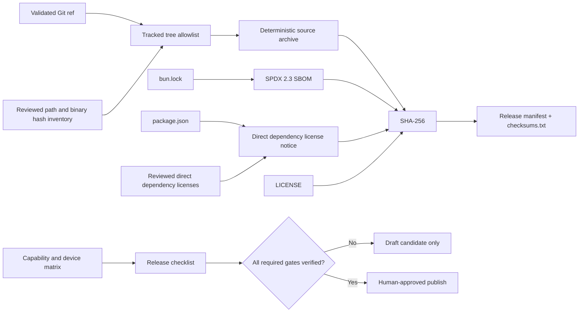

# OSS Alpha Release 設計

## 問題

GitHub の自動 Source Archive だけでは、どの依存と License を含むか、どの検証が `Not run` か、同じ
Commit から同じ Candidate を作れるかを判断できない。一方、実機 Gate が未達の状態で Native Artifact を
公開すると、Green CI を実機互換性の証拠へ読み替えることになる。

## 代替案

### 案 A: GitHub 自動 Archive と手書き Release Notes だけを使う

- 利点: 追加コードが少ない。
- 欠点: SBOM、License Notice、全 Artifact checksum、除外対象、再現性を機械検査できない。

### 案 B: 外部 Release / SBOM Action を追加する

- 利点: 多形式の Artifact と SBOM を短時間で生成できる。
- 欠点: Action と Generator 自体の Supply Chain、設定、Version 更新が新しい信頼境界になる。Bun Lock と
  Repository 固有の `Not run` 契約をそのまま表現しにくい。

### 案 C: Repository-native Bun CLI と最小 Release Workflow を使う

- 利点: Version、Git ref、追跡 File、Lockfile、checksum、状態 Matrix を同じ Review 対象にできる。
  `git archive` は未追跡 File と Build Output をデフォルトで除外し、Command は argv 配列で実行できる。
- 欠点: SPDX と License Notice の生成責務を Repository が保守する必要がある。

案 C を採用する。Source-only Alpha では Native / Web Binary を添付せず、追跡 Source Archive、SPDX SBOM、
Project License、直接依存 License Notice、Release Manifest、SHA-256 record だけを Candidate にする。
Native Artifact は Issue 17、18、20、22、28 の物理 Gate 後に別の Artifact Kind として追加する。

## データフローと責務

- `scripts/source-release.ts`: 入力検証、Git ref の固定、追跡 Tree の禁止 Path 検査、Archive、SPDX、Notice、
  Manifest、checksum の生成を担当する。Manifest は `draft-candidate` を明記し、未知 Field、成果物集合、Version、
  Commit、タイムスタンプ、Size、SHA-256 の不整合を strict validator で拒否する。Blob size は内容を読む前に
  `git cat-file -s` で確定し、Archive は child process から File へ streaming する。
- `scripts/source-release-inventory.json`: 固定 Commit に含めてよい全 Path と、許可した Binary Asset の
  SHA-256 を Review 単位で固定する。未登録 Path、Binary hash 不一致、Text として検証できない未登録 Blob、
  Size 上限超過を拒否する。
- `bun.lock`: Source Candidate が依存しうる全 Package Version と Integrity の正本にする。
- `scripts/direct-dependency-licenses.json`: 直接依存の Review 済み License 宣言を固定 Commit から読む。
  Package、Version、top-level Lock key が `package.json` と `bun.lock` に完全一致しなければ拒否する。
- Release Workflow: default branch の `workflow_dispatch` だけを入口にし、Version、既存 Tag、40 桁 Candidate
  Commit の一致と Candidate が実行中の `main` の祖先であることを read-only Job で確認する。保護 Environment
  の承認後にだけ開始する checkout-free publish Job は Environment と更新 / 削除禁止の active Tag Ruleset を
  API で確認する。Ruleset 検査だけは保護 Environment の `OSS_ALPHA_RULESET_AUDIT_TOKEN` を使う。この Token は
  単一 Repository 専用、`Administration: write`、Repository code を実行しない GET-only step に限定する。
  通常の `GITHUB_TOKEN` へ fallback せず、write access がない API 応答で省略される `bypass_actors` の存在、
  配列型、空集合を必須にする。
  検証 Job が frozen install、全品質 Gate、Candidate 2 回生成の byte 比較、copy 後の strict output / checksum
  検証、Release Notes を含む Bundle checksum、固定名 Bundle の Upload を担う。Repository を checkout しない別 Job
  だけが `contents: write` を持ち、Download 後の exact File 集合と checksum、Tag / Candidate SHA を再検証して
  新規 Draft Release を作る。
- Release Checklist: 物理 Gate を Repository Test から分離し、`Not run` が 1 件でも必要条件に残る場合は
  Public Release を止める。

## 依存方向

Release CLI は Git、Lockfile、Package metadata を外部入力として境界で検証する。App / Domain は Release CLI を
import しない。Workflow は CLI と既存 Make target を呼ぶだけとし、Release 規則を YAML に複製しない。

## エッジケースと異常系

- Version が strict SemVer でない、Git ref が曖昧、ref の `package.json` Version と一致しない場合は拒否する。
- Output が symlink、File、空を含む既存 Directory、または直接 Parent symlink の場合は拒否する。成果物は Parent
  と非公開 sibling staging Directory の descriptor を保持し、staging descriptor 配下へだけ書く。strict 検証後は
  保持済み Parent descriptor と basename に対して、macOS では `renameatx_np(RENAME_EXCL)`、Linux では
  `renameat2(RENAME_NOREPLACE)` を使い、検証済み staging inode を Output 名へ原子的に確定する。公開後も同じ Parent
  descriptor から Output を開いて inode を検証し、requested Parent / Output Path も同じ descriptor を指すことを
  再照合する。不一致時は Output 名から staging 名へ戻して成功を返さない。独立 verifier は symlink ancestor を拒否し、
  Candidate directory descriptor から各 File を開くため、Path の差し替えで別 Parent や偽 Candidate へ迂回しない。
  検証済み各 File の device / inode / size / ctimeNs / mtimeNs と開始時の Directory metadata を記録し、return 直前に
  identity-bound exact entry set と全 basename の descriptor-relative File snapshot を再照合する。検証中の extra entry
  追加、hash 後の rename 置換、同一 inode への in-place 書換えも拒否する。生成経路の atomic publish 後検証は retained
  staging handle / expected inode に固定し、検証前後で Output basename も同じ handle を指すことを要求する。
  未対応 OS /
  Filesystem は通常 rename へ fallback せず停止する。競合時は既存
  inode を置換しない。失敗 cleanup は個別 File を削除せず、staging Directory 全体を保持済み Parent descriptor 内の
  一意な `.tenkacloud-passport-failed-*` 名へ no-replace rename して inode を再確認する。隔離 Directory は cleanup
  未完了として残すが requested Output にはせず、他 Process の entry を誤削除しないことを自動削除より優先する。
  transaction 確立前に staging identity を取得できない場合も、同名 entry を Path から削除しない。
- 追跡 Tree が Review 済み Path inventory と完全一致しない場合は拒否する。Binary は Asset Path と SHA-256 を
  inventory へ固定し、全 Blob byte の既知 Secret scan、1 File / 全体 Size 上限も通らなければならない。
- 追跡 Tree に `.gguf`、秘密鍵、Certificate、Provisioning、Participant 記録、生成 Native Project、
  Build Output があれば拒否する。
- Lockfile が読めない、Package record が不正、Review 済み直接依存の Version / License が一致しない場合は拒否する。
- License が複合 SPDX expression の場合は文字列を変更せず Notice と SBOM へ残す。
- 同じ名前の複数 transitive Version は別 SPDX Package とし、名前だけで去重しない。
- Source-only Alpha では Artifact Matrix の Native 欄を空にせず `Not run` / `Blocked` と明記する。
- Candidate Directory と handoff Bundle は exact File 集合を持つ。checksum の重複、未知 / 欠落 File、絶対 Path、
  traversal、digest / size 不一致を拒否し、Release upload は glob ではなく固定 File 名を列挙する。
- Workflow 再実行時に同じ Draft Release がある場合は自動上書きせず停止し、Operator が既存 Draft を確認する。

## Rollback

CLI と Workflow の Merge は App Runtime を変更しない。問題があれば Merge Commit を revert し、誤った Draft
Release は公開せず削除する。すでに公開済みの Source Archive は上書きせず、Version を上げた訂正版と
Known Limitation を公開する。
